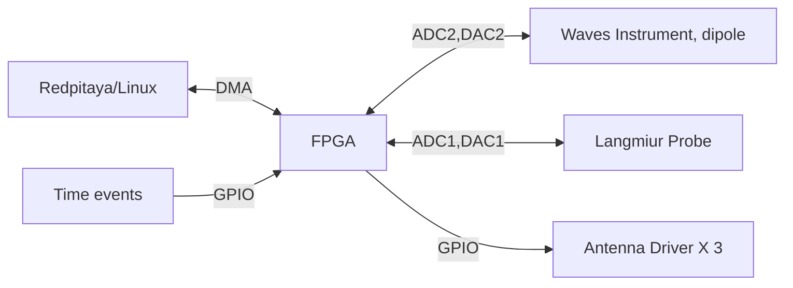

# RockSat-main

Redpitaya based data acquisition and storage system developed for the Rocksat-X (2024) payload for the West Virginia University team.

RockSat-main is an FPGA/embedded linux based system that is run on a [Redpitaya-STEMlab](https://redpitaya.com/stemlab-125-14/) supporting main antenna deployment, Langmuir probe and the waves experiments. This project is implemented using Xilinx, C and Python. This project contains all the tools developed to test during pre flight and vibration testing as well as flight ready software for the final flight.

## My contributions

- Designed a custom FPGA image to fulfill the mission requirements
	- Antenna deployment
	- Langmuir probe experiment (DAC and ADC)
	- Waves - experimental RF payload to generate broadband RF noise during flight 0-30 MHz and save spectra for post processing after flight
- Performed software verification and testing
- Wrote testing scripts in python to test the payload operation and deployable during testing
- Developed final flight software 

## Demo/Testing 

### Langmuir probe sweeps 

Figure shows the Lp sweep generated to drive the probe 
### 0-30 MHz RF generation

Figure shows measured RF pulses in the waterfall measured from an external SDR

### Abstracts

Conner, D., Bowman, J., Lusk, G., Perera, H., Goodrich, K., Fowler, C.M., Bonnell, J.W. and Ghalsasi, N., 2025, December. WVU RockSat-X; Lab Plasma Calibrated Ionospheric Density Profile from In-Situ Sounding Rocket. In AGU Fall Meeting Abstracts (Vol. 2025, No. 2356, pp. SA31E-2356).

Conner, D., Bowman, J., Lusk, G., Perera, H., Ghalsasi, N., Goodrich, K., Fowler, C.M. and Bonnell, J.W., 2024, December. WVU RockSat-X; Ionospheric Density Profile Analysis from In-Situ Sounding Rocket. In AGU Fall Meeting Abstracts (Vol. 2024, No. 2448, pp. SA31C-2448).

